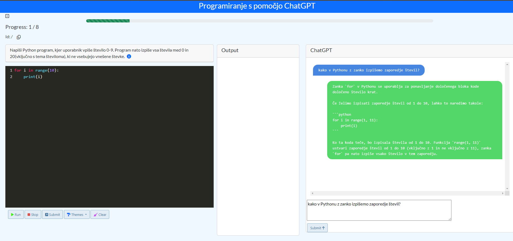

# hiter-inzeniring-diploma

Izvorna koda za diplomsko delo Hiter inženiring pri razvoju programske opreme.
Spletna stran je na voljo na spletni povezavi https://spin311.github.io/diploma/ .
Zaledje ter ChatGPT API trenutno na strani niso zagnani zaradi stroškov namestitve.
Koda je razdeljena v dve mapi za uporabniški vmesnik v mapi "frontend" ter zaledje v mapi "backend". V mapi "naloge" se nahajajo naloge, ki so jih učenci reševali.
### Navodila za lokalno postavitev
Uporabniški vmesnik je na voljo na povezavi: https://spin311.github.io/diploma/ .
# Lokalna postavitev zaledja

## Predpogoji
Prepričajte se, da imate na svojem sistemu nameščeno naslednje:

- **Java Development Kit (JDK) 11 ali novejši**: [Prenesite JDK](https://www.oracle.com/java/technologies/javase-jdk11-downloads.html)
- **Maven**: [Prenesite Maven](https://maven.apache.org/download.cgi)

## Zagon Projekta

Klonirajte repozitorij in se pomaknite v mapo projekta:

```bash
git clone [https://github.com/spin311/hiter-inzeniring-diploma](https://github.com/spin311/hiter-inzeniring-diploma)
cd backend

mvn clean install
mvn spring-boot:run
```
Aplikacijo lahko dostopate na:

http://localhost:8080
